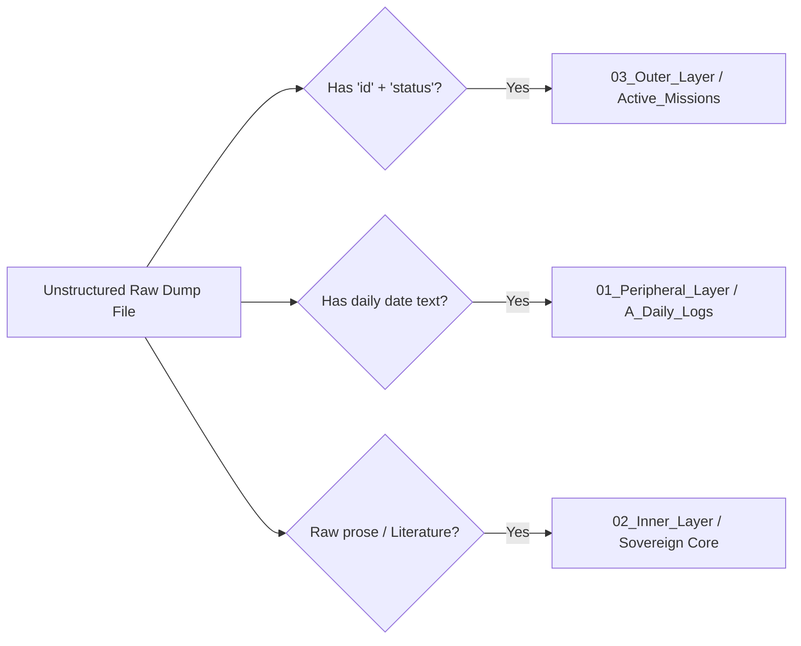

# DiegoOS Ingestion Protocol & Tri-Layer Triage Manual

This document establishes the binding framework for processing raw copy-pasted textual information received from application boards, emails, and target portals into the constraint-enforced ecosystem.

---

## 1. Peripheral Entry Phase (01_Peripheral_Layer)

### Raw Data Dumping Protocol
* All unstructured data dumps must be initiated inside `01_Peripheral_Layer/A_Daily_Logs/` or the designated staging scratchpad.
* Avoid any formatting, renaming, or structural alterations during the raw paste activity to protect data integrity from source parameters.

### Urgency Tagging System
During input registration, any checklist items (`- [ ]`) containing high-importance flags must append a pipe parameter matching one of these strict tracking schemas:
* `| Urgency: Critical` ➔ Triggers high-visibility structural alert banner `!!! URGENT ACTION REQUIRED !!!` at the top of the Master Dashboard.
* `| Urgency: High` ➔ Elevates the task to the top row layout of the Pending Logistics Ledger.
* `| Urgency: Standard` ➔ Enters standard database queue sorting.

---

## 2. Ingestion Routing Logic (Triage Engines)

When running automated data processing scripts (`vault_automation.py`), files residing in cold staging are evaluated against the following structural constraints:

### Route A: Sovereign Inner Layer (02_Inner_Layer)
* **Target Mapping:** Directed exclusively to `Conceptual_Notes/` or `Literature/`.
* **Execution Constraint:** Automated scripts scrub out conversational text fillers, contextual greetings, and machine-prose artifacts (e.g., "Here is a summary," "Hope this helps"). Only pure human content, theoretical extractions, or source assets are retained.

### Route B: Execution Engine (03_Outer_Layer)
* **Target Mapping:** Directed exclusively to `Active_Missions/`.
* **Execution Constraint:** Appends strict standardized YAML block syntax at the absolute top of the note. Verifies and enforces date configurations against regional parameter hierarchies.

### Route C: Logistical Registration (01_Peripheral_Layer)
* **Target Mapping:** Directed exclusively to `A_Daily_Logs/`.
* **Execution Constraint:** Parses data into date-stamped registries to update system telemetry grids.

---

## 3. Mandatory Date Normalization Rules

To prevent date-notation anomalies, formatting lockups, or frozen $37\text{-day}$ calculation proxies, all frontmatter blocks must be explicitly processed via the following rules:

1. **Expunge US Formats:** The layout engine prohibits tracking dates via `MM/DD/YYYY` format frameworks.
2. **ISO Standard Preference:** Frontmatter trackers should use `YYYY-MM-DD` strings natively.
3. **UK/Latin American Normalization Hierarchy:** Raw textual inputs configured as `DD/MM/YYYY` or long strings with English ordinal descriptors (e.g., `12th June 2026`) are processed by stripping suffix markers and translating parameters into native ISO configurations.
4. **T-1 Freeze Offset Calibration:** For any active mission card, the automated logic layer calculates a system freeze threshold exactly **24 hours prior** to the designated target deadline string (`portal_submission - 1 day`).

---

## 4. Lifecycle Evacuation Rules (Post-Cycle Cleanup)

Active targets are subject to a strict evaluation lifecycle to prevent cognitive bloat in search panels and timeline views:
* **Pruning Triggers:** Cards that pass their absolute date parameters are deemed overdue or archived.
* **Tidier Script Execution:** Running `card_tidier.py` identifies outdated metrics and automatically shifts files back into `_Cold_Storage/02_AREAS/Application_Pipeline/legacy/`.
* **Search Exclusion:** Once evacuated to cold storage, files are matched by user exclusion strings, removing them from standard workspace search indexes while keeping the core texts archived for reuse reframing.
